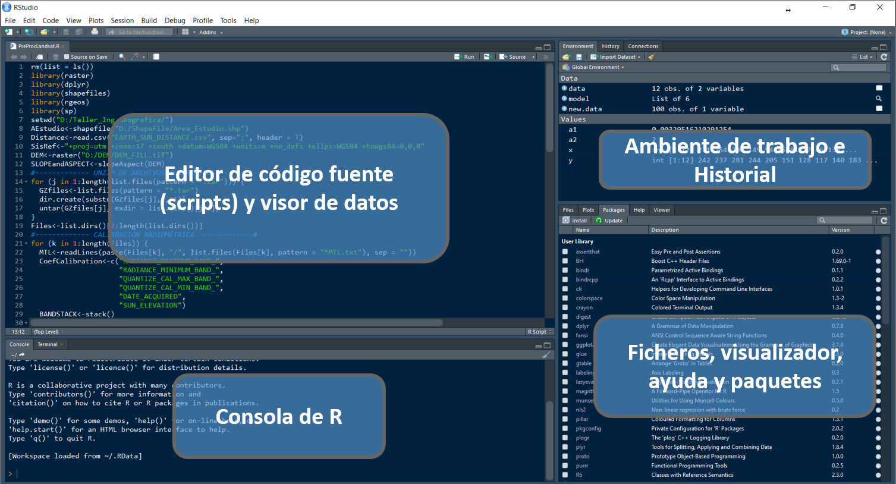

# Introducción a R

## Instalación de R, RStudio y RTools

### R
<p style='text-align: justify;'> Distribución e instalación - Para instalar R hay que bajar un fichero ejecutable de la página web del proyecto R: [**http://www.r-project.org/**](http://www.r-project.org/) - Actualmente (Mayo 2021), la versión más reciente de R para el entorno Windows es la 4.1.0 y el ejecutable de tamaño aproximadamente 86Mb tiene el nombre R-4.1.0-win.exe - Una vez bajado este ejecutable, hay que ejecutarlo y seguir las instrucciones del programa de instalación. </p>

<p align="center">
  
</p>


### Rstudio
<p style='text-align: justify;'> RStudio es un editor para scripts disponible para usuarios de R en todos los sistemas operativos. - Es considerado como un **<u>entorno de desarrollo integrado (GUI)</u>** que combina un interfaz muy intuitiva con herramientas de código muy potentes que permiten sacar el máximo provecho a R. - La versión en pruebas es gratuita y está disponible en [**http://www.rstudio.org/**](http://www.rstudio.org/) - La ventaja de este editor es que ofrece una serie de opciones no existentes en R, entre otras, por ejemplo, comprobar rápidamente que ningún paréntesis queda sin cerrarse o marcar, copiar y pegar columnas. - Pero además nos da un listado de las variables y nos da una descripción de los bancos de datos que hemos introducido. También tiene una lista de los paquetes instalados y los gráficos realizados.</p>

<p align="center">
  
</p>

### RTools
<p style='text-align: justify;'> Herramientas para construir paquetes de R. Esto es lo que desea para construir sus propios paquetes en Windows, o para construir R por sí mismo.</p> 

<p style='text-align: justify;'> A partir de **R 4.0.0** (lanzado en abril de 2020), R para Windows usa un paquete de cadena de herramientas llamado **<u>rtools40</u>**.</p> 

<p style='text-align: justify;'> Esta versión de **<u>Rtools</u>** incluye gcc 8.3.0 e introduce un nuevo sistema de compilación basado en [**msys2**`](https://www.msys2.org/), que facilita la compilación y el mantenimiento de R, así como las bibliotecas del sistema que necesitan los paquetes de R en Windows. Las compilaciones recientes de **rtools40** también contienen una cadena de herramientas adicional gcc-10 ucrt para probar paquetes de R y bibliotecas del sistema con las compilaciones ucrt experimentales de R-devel. Para obtener más información sobre estos temas, siga los enlaces al final de este documento.</p>

<p style='text-align: justify;'> Jeroen Ooms mantiene la versión actual de Rtools. El profesor Brian Ripley y Duncan Murdoch prepararon [**ediciones anteriores**](https://cran.r-project.org/bin/windows/Rtools/history.html). El mejor lugar para informar errores es a través de la organización [**r-windows**](https://github.com/r-windows) en GitHub.</p>


## ¿Qué es R?
<p style='text-align: justify;'> - Proporciona un amplio abanico de herramientas estadísticas (modelos lineales y no lineales, tests estadísticos, análisis de series temporales, algoritmos de clasificación y agrupamiento, etc.).</p>

<p style='text-align: justify;'> - Permite definir funciones propias. De hecho, gran parte de las funciones de R están escritas en el mismo R, aunque para algoritmos computacionalmente exigentes es posible desarrollar bibliotecas en C, C++ o Fortran que se cargan dinámicamente.</p>

<p style='text-align: justify;'> - R hereda de S su orientación a objetos.</p>

<p style='text-align: justify;'> - R puede integrarse con distintas bases de datos y existen bibliotecas que facilitan su utilización desde lenguajes de programación interpretados como Python (PythonInR) `r emo::ji("heart")`.</p>

<p style='text-align: justify;'> - Otra de las características de R es su capacidad gráfica, que permite generar gráficos con alta calidad (ggplot). R posee su propio formato para la documentación basado en LaTeX.</p>

## ¿Qué es RStudio?

<p style='text-align: justify;'> - RStudio es un editor para scripts disponible para usuarios de R en  todos los sistemas operativos.</p>

<p style='text-align: justify;'> - Es considerado como un **<u>entorno de desarrollo integrado (GUI)</u>** `r emo::ji("clock")`  que combina un interfaz muy intuitiva con herramientas de código muy  potentes que permiten sacar el máximo provecho a R.</p>

<p style='text-align: justify;'> - La versión en pruebas es gratuita y está disponible en  [http://www.rstudio.org/](http://www.rstudio.org/).</p>

<p style='text-align: justify;'> - La ventaja de este editor es que ofrece una serie de opciones no  existentes en R, entre otras, por ejemplo, comprobar rápidamente que ningún paréntesis queda sin cerrarse o marcar, copiar y pegar columnas.</p>

<p style='text-align: justify;'> - Pero además nos da un listado de las variables y nos da una descripción de los bancos de datos que hemos introducido. También tiene una lista de los paquetes instalados y los gráficos realizados.</p>

## ¿Qué otros IDE’s existen para R?

- Tinn-R
- RKward
- Rcommander
- Jupyter notebook
- Visual studio code
- Pycharm
- Eclipse

## ¿Qué son los paquetes en R?

```{r eval=FALSE}
# Install packages
install.packages("tidyverse")
# Load packages
library(tidyverse)
# You can also use "pacman" package to install
#  an loading other packages
if (!require("pacman")) {
  install.packages("pacman")
}
pacman::p_load(
  tidyverse, formatR, knitr, rmdformats, pander, labelled, readxl, magrittr, kableExtra
)
```

## Tipos de lenguajes de programación

### Lenguaje compilado
<p style='text-align: justify;'> Son aquellos lenguajes de alto nivel que como su nombre lo sugiere, requieren de un compilador (programa que traduce un lenguaje de alto nivel en código máquina o lenguaje máquina) para traducirlo y crear la parte ejecutable.</p>

- C++
- Go

### Lenguaje interpretado
<p style='text-align: justify;'> Son aquellos lenguajes de programación también de alto nivel en donde el código fuente debe ser traducido a un lenguaje que la máquina entienda y pueda realizar, no crean un archivo externo.</p>

- Ruby
- Javascript
- Python
- R

<p style='text-align: justify;'> Los lenguajes de alto nivel permiten escribir instrucciones en un idioma muy parecido al inglés así como hacer uso de notaciones matemáticas comunes.</p>

### Lenguaje intermedio
<p style='text-align: justify;'> Los lenguajes intermedios son compilados hacia programas intermedios y luego interpretados, esto permite que pueda ser ejecutado desde cualquier sistema operativo sin necesidad de crear ejecutables.</p>

- Java
- C#
- Elixir

<p align="center">
  
</p>

## Paradigmas de programación
### Programación Estructurada
### Programación Orientado a Objetos
### Programación Reactiva
### Programación Funcional

<p align="center">
  
</p>

## Ambiente de trabajo en RStudio

<p align="center">
  
</p>

## Mi primer "Hello world"
```{r}
print("Mi primera línea en R")
```

## Tipos de datos en R (character, numeric, logical, date)

<p style='text-align: justify;'> R es capaz de manejar una variedad de tipos de datos, que se almacenan en diferentes estructuras como se puede observar en la siguiente tabla:</p>

| Tipos de Datos | Información | Definición |
| :-: | :-----: | :----: |
| `Numeric` | Datos contenidos en el conjuntos de los números reales | `num <- 3.14` |
| `Integer` | Datos contenidos en el conjuntos de los números enteros | `int <- 3L` |
| `Character` | Datos que soportan cadenas de caracteres | `chr <- "hello world"` |
| `Complex` | Datos que soportan números complejos | `comp <- 3+2i` |
| `Logical` | Datos que sólo soportan valores lógicos de verdadero (T) o falso (F) | `a <- 1; b <- 2; a < b` |
| `Factor` | Este no es estrictamente un tipo de dato, pero vale la pena describirlo aquí. Una variable factor es una variable categórica. Los vectores de caracteres a menudo se almacenan como factores para explotar funciones para tratar datos categóricos. Por ejemplo, en análisis de regresión | Aplique `as.factor()` a un vector de caracteres o numéricos |

## Tipos de estructuras de datos (vector, matrix, dataframe, list)
| Objetos | Tipos |¿Soporta varios tipos de datos en el mismo objeto? |
|:--:| :-----: | :--: |
| `Vector` | Numérico, carácter, complejo o lógico | No |
| `Factor` | Numérico o lógico | No |
| `Arreglo` | Numérico, carácter, complejo o lógico | No |
| `Matriz` | Numérico, carácter, complejo o lógico | No |
| `Data frame` | Numérico, carácter, complejo o lógico | Sí |
| `ts` | Numérico, carácter, complejo o lógico | Sí |
| `Lista` | Numérico, carácter, complejo, lógico, función, expresión, … | Sí | 

### Vector

- Es el lemento más básico en R.
- Contiene elementos de la misma clase (son atómicos).
- Se crea con la función c(), que significa ‘concatenar’ o ‘combinar’.

```{r}
vector01 <- c(1, 2, 4, 7, 10, 11, 12, 19, 26)
vector01
vector02 <- c("a", "b", "d", "g", "j", "k", "l", "s", "z")
vector02
vector03 <- c("jorge", "roy", "daniel", "cesar", "patin", 254, 265)
vector03
vector04 <- c(FALSE, FALSE, FALSE, TRUE, TRUE, TRUE, TRUE)
vector04
```

#### Algunas operaciones con vectores
```{r}
# indexar vectores
vector01
vector01[4]
# evaluar la naturaleza del vector
a <- vector01[4]
is.vector(a)
is.numeric(a)
is.integer(a)
# operaciones con vectores
length(vector01)
(vector01 * 2) + 500
sum(vector01)
sqrt(vector01 - 1)
vector01 + (vector01 * 2)
```

#### Secuencias numéricas
```{r}
# x:y puede leerse como “secuencia de x a(:) y”
1:20
pi:10
15:1
# seq(x,y,by,length) puede leerse como “secuencia de x a(:) y” con
# "by" incrementos o "length" de elementos
seq(0, 21)
seq(0, 21, by = 3)
seq(0, 21, length = 20)
```

### Factor

<p style='text-align: justify;'> En R, los factores se usan para trabajar con variables categóricas, es decir, variables que tienen un conjunto fijo y conocido de valores posibles. También son útiles cuando quieres mostrar vectores de caracteres en un orden no alfabético.</p>

<p style='text-align: justify;'> Históricamente, los factores eran más sencillos de trabajar que los caracteres. Como resultado, muchas de las funciones de R base automáticamente convierten los caracteres a factores. Esto significa que, a menudo, los factores aparecen en lugares donde no son realmente útiles. Afortunadamente, no tienes que preocuparte de eso en el **tidyverse** y puedes concentrarte en situaciones en las que los factores son genuinamente útiles.</p>

<p style='text-align: justify;'>Si quieres aprender más sobre factores, te recomendamos leer el artículo de Amelia McNamara y Nicholas Horton, [**Wrangling categorical data in R**](https://peerj.com/preprints/3163/) (el nombre significa Domando/Manejando Datos Categóricos en R). Este artículo cuenta parte de la historia discutida en [**stringsAsFactors: An unauthorized biography**](https://simplystatistics.org/2015/07/24/stringsasfactors-an-unauthorized-biography/) (del inglés cadenasComoFactores: Una Biografía No Autorizada) y [**stringsAsFactors = <sigh>**](https://notstatschat.tumblr.com/post/124987394001/stringsasfactors-sigh) (del inglés cadenasComoFactores = <suspiro>), y compara las propuestas tidy para los datos categóricos demostrados en este libro, en comparación a los métodos de R base. Una versión temprana de este artículo ayudó a motivar y definir el alcance del paquete forcats. ¡Gracias Amelia y Nick!</p>

Imagina que tienes una variable que registra meses:

```{r}
vect01 <- c("Dec", "Apr", "Jan", "Mar", "Jan", "Mar")
```

Usar una cadena de caracteres (o string, en inglés) para guardar esta variable tiene dos problemas:

1. Solo hay doce meses posibles y no hay nada que te resguarde de errores de tipeo:

```{r}
vect02 <- c("Dec", "Apr", "Jam", "Mar", "Jan", "Mar")
```

2. No se ordena de una forma útil:

```{r}
sort(vect02)
```

Puedes solucionar ambos problemas con un `factor`. Para crearlo, debes empezar definiendo una lista con los niveles válidos:

```{r}
month_levels <- month.abb
```

Ahora puedes crear un factor:

```{r}
factor01 <- factor(vect01, levels = month_levels)
factor01
sort(factor01)
```

Cualquier valor no fijado en el conjunto será convertido a `NA` de forma silenciosa:

```{r}
factor02 <- factor(vect02, levels = month_levels)
factor02
```

Si quieres una advertencia, puedes usar readr::parse_factor() (segmentar un factor, en inglés):

```{r}
readr::parse_factor(vect02, levels = month_levels)
```

Si omites los niveles, se van a definir a partir de los datos en orden alfabético:

```{r}
factor(vect01)
```

A veces es preferible que el orden de los niveles se corresponda con su primera aparición en los datos. Puedes hacer esto cuando creas el factor, al definir los niveles con `unique(x)` o después con `fct_inorder()`.

```{r}
factor(vect01, levels = unique(vect01))
forcats::fct_inorder(factor(vect01))
```

### Matrix

<p style='text-align: justify;'> Una matriz es una `estructura bidimensional`. Las filas son horizontales y las columnas son verticales. `Una matriz de 4 por 3 (4 x 3), por ejemplo, tiene 4 filas y 3 columnas`. Las matrices se crean comúnmente usando tablas de datos numéricos como las de una hoja de cálculo de `Excel` o un archivo `csv`.</p>

```{r}
vector01
dim(vector01)
```

Dado que la variable es un vector, no tiene un atributo `dim` (entonces es simplemente NULL).

¿Qué ocurre si le damos a `vector01` un atributo `dim`?

```{r}
dim(vector01) <- c(3, 3)
vector01
class(vector01)
```

<p style='text-align: justify;'> El ejemplo que utilizamos hasta ahora tenía la intención de ilustrar la idea de que una matriz es simplemente un vector con un atributo de dimensión.</p>

Un método más directo para crear la misma matriz utiliza la función matrix.

```{r}
matrix01 <- matrix(vector01, nrow = 3, ncol = 3, byrow = T)
matrix01
```

```{r}
arboles <- c("Tipuana tipu", "Myrsine andina", "Salix humboldtiana")
matrix02 <- cbind(arboles, matrix01) # column bind o juntar por columna.
matrix02
```

<p style='text-align: justify;'> Esto se llama **coerción implícita** porque no lo hemos pedido. Solo sucedió. Sin embargo, todavía se desea trabajar con diferentes tipos de datos.</p>

```{r}
class(matrix02)
dim(matrix02)
rownames(matrix02)
colnames(matrix02)
```

### Data Frame

<p style='text-align: justify;'> Un data frame es una estructura de datos bidimensional similar a una matriz, pero funciona de manera muy diferente. Si bien un data frame parece una tabla simple, de hecho es una lista de vectores de la misma longitud. Para los nuevos usuarios de R, las matrices y los data frames parecen similares. La principal diferencia es que un data frame permite tipos de datos mixtos (por ejemplo, numérico, lógico, caracter). Esto les permite almacenar diferentes tipos de variables, lo cual es muy útil en el análisis estadístico. Por ejemplo, en un análisis de regresión. Las matrices se usan principalmente para almacenar datos numéricos, y se pueden usar para álgebra matricial.</p>

<p style='text-align: justify;'> Matrices y Data Frames, ambos representan tipos de datos **rectangulares**, lo que significa que se usan para almacenar datos tabulares, con filas y columnas.</p>

<p style='text-align: justify;'> La principal diferencia, es que las **matrices** solo pueden contener una única clase de datos (al igual que los vectores), mientras que los **dataframes** pueden consistir de muchas clases diferentes de datos.</p>

```{r}
 # se crea un data frame (df)
df01 <- data.frame(arboles, matrix01)
df01
class(df01)
# podemos cambiar el nombre a las variables (columnas)
colnames(df01) <- c("nombre_cientifico", "circunferencia", "diametro_copa", "altura" )
df01
```

#### Conjunto de datos en R

<p style='text-align: justify;'> Varios conjuntos de datos tabulados o datasets se icluyen en la instalación de R (en el paquete datasets) y por defecto se ecuentran cargados para su uso. la funcion `data()` lista todos los `datasets de R`.</p>

Trabajemos con el dataset `iris` **(Edgar Anderson’s Iris Data)**

```{r}
str(iris)
# todas las observaciones de la columna 'Species'
iris[, "Species"]
# Se utiliza el caracter ‘$’ para acceder a los campos o columnas.
iris$Species
```

Cuando queremos extraer datos del data frame según una condicion, esto se complica.

```{r}
head(iris[iris$Species == "setosa", ])
```

<p style='text-align: justify;'> Así mismo, si se desea obtener las observaciones donde el ancho del sépalo sea menor o igual a 3 y la especie sea “setosa”.</p>

```{r}
head(iris[iris[, "Sepal.Width"] <= 3 & iris[, "Species"] == "setosa", ])
```

#### Subsetting

La función `subset` nos facilita filtrar datos cuando queremos que se cumplan ciertas condiciones.

```{r}
subset(iris, Sepal.Width <= 3 & Species == "setosa")
```

**¿Pero es la mejor opción?**

**¿Cómo ordeno?**
**¿Cómo cambio de un formato “ancho” a un formato “largo” (o viceversa)? etc.**

La tendencia en la comunidad R para el tratamiento de datos, comprende el uso de [<u>**tidyverse**</u>](https://www.tidyverse.org/).

### Listas

<p style='text-align: justify;'> A diferencia de un vector, una lista es una colección de elementos que pueden ser de diferente tipo. Los componentes de una lista son típicamente pares **clave-valor (key-value)**. El siguiente ejemplo muestra cómo se puede almacenar un punto (con coordenas) en una lista.</p>

```{r}
# Los elementos de la lista generalmente se acceden por nombre
coordenadas <- list(x = 10, y = 15)
coordenadas
point <- list(id = 123, coord = coordenadas, spatial.reference = "WGS_84")
point
point$id
# También podemos acceder a sus elementos de la siguiente manera
point[1]
class(point[1])
# Para obtener el valor del elemento de la lista, use corchetes dobles
point[[1]]
class(point[[1]])
```

<p style='text-align: justify;'> La lista, en el ejemplo, tiene tres elementos de diferentes tipos de datos. `id` es numérico, `coord` es otra lista y `spatial.reference` es una cadena de caracteres. La lista `coord` contiene dos elementos numéricos, `x` e `y`. Generalmente, se accede a los elementos de la lista usando su nombre, en lugar de número. En particular, muchas estructuras de datos tienen elementos con nombre a los que se puede acceder utilizando los operadores `$` o `@`.</p>

## Lectura / escritura de datos (.csv, .xlsx. RData, .rds)

<p style='text-align: justify;'> En la pestaña en Entorno **(Environment)** de **RStudio** podemos importar conjuntos de datos o datasets con el asistente de importación. No es recomendable cuando debemos importar varios archivos o si se van a leer archivos grandes. Para lo cual es más eficiente usar código.</p>

<p align="center">
  
</p>

### CSV

Si conocemos la estructura de nuestros datos (por ejemplo, la primera fila es el título de las columnas o es un archivo separado por comas), Se pueden utilizar las funciones **`read.csv` (librería base) o `read_csv` (librería readr, de tidyverse)**:

```{r}
# datos será un 'data frame'
data01 <- read.csv(file = 'file.csv')
head(data)
# datos será un 'tibble'
data01 <- readr::read_csv(file = 'file.csv')
data01
```

En otros casos, cuando `";"` es utilizado como el separador de campo y `","` para el punto decimal, se utiliza una variante de estas funciones.

```{r}
# datos será un 'data frame'
data02 <- read.csv(file = 'file.csv', sep = ',', header = T)
data02 <- read.csv(file = 'file.csv', sep = ',', header = F)
```

La escritura de datos se realiza de la siguiente manera:

```{r}
readr::write_csv(x = data02, file = "csv_data.csv")
```

### EXCEL

Es posible leer datos en la forma `.xls` o `.xlsx`. Existen distintos paquetes que nos permiten hacerlo:

- El paquete **readxl** contiene la función `read_excel`.
- El paquete **xlsx** y la función `read.xlsx`

```{r}
# datos será un 'data frame'
data03 <- readxl::read_xls(path = 'file.xls', sheet = 1)
data03 <- xlsx::read.xlsx(file = "file.xls", 1)
```

La escritura de datos se realiza de la siguiente manera:

```{r}
xlsx::write.xlsx(
  data03, "xlsx_data.xlsx", sheetName = "Sheet1", 
  col.names = TRUE, row.names = TRUE, append = FALSE
)
```

### RDS

R proporciona dos formatos de archivo propios para almacenar datos, **.RDS** y **.RData** . Los archivos **RDS** pueden almacenar **un solo objeto R** y los archivos **RData** pueden almacenar **varios objetos R**.

Puede abrir un archivo RDS con `readRDS`:

```{r}
data04 <- readRDS("file.RDS")
```

La escritura de datos se realiza de la siguiente manera:

```{r}
saveRDS(data04, file = "rds_data.RDS")
```

### RDATA

La escritura de estos datos se realiza de la siguiente manera:

```{r}
a <- 1
b <- 2
c <- 3
save(a, b, c, file = "stuff.RData")
```

Puede abrir un archivo RData con `load`:

```{r}
load("stuff.RData")
```

## Funciones de R base (sum, cor, mean, sd, quantile)
```{r Funciones de R base}
```

## Asignación de objetos

Crear un repositorio del curso en `Github`, copiar el enlace en la plataforma de google classroom
[<u>https://github.com/tonsky/FiraCode</u>](https://github.com/tonsky/FiraCode)
