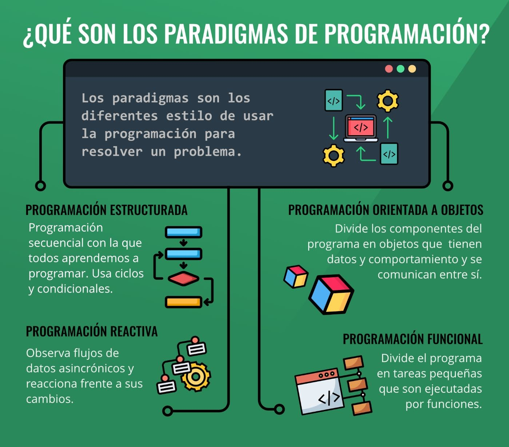

# Introducción a R

## Instalación de R, RStudio y RTools

### R
Distribución e instalación - Para instalar R hay que bajar un fichero ejecutable de la página web del proyecto R: [**http://www.r-project.org/**](http://www.r-project.org/) - Actualmente (Mayo 2021), la versión más reciente de R para el entorno Windows es la 4.1.0 y el ejecutable de tamaño aproximadamente 86Mb tiene el nombre R-4.1.0-win.exe - Una vez bajado este ejecutable, hay que ejecutarlo y seguir las instrucciones del programa de instalación.

<p align="center">
  
</p>


### Rstudio
RStudio es un editor para scripts disponible para usuarios de R en todos los sistemas operativos. - Es considerado como un **<u>entorno de desarrollo integrado (GUI)</u>** que combina un interfaz muy intuitiva con herramientas de código muy potentes que permiten sacar el máximo provecho a R. - La versión en pruebas es gratuita y está disponible en [**http://www.rstudio.org/**](http://www.rstudio.org/) - La ventaja de este editor es que ofrece una serie de opciones no existentes en R, entre otras, por ejemplo, comprobar rápidamente que ningún paréntesis queda sin cerrarse o marcar, copiar y pegar columnas. - Pero además nos da un listado de las variables y nos da una descripción de los bancos de datos que hemos introducido. También tiene una lista de los paquetes instalados y los gráficos realizados.

<p align="center">
  
</p>

### RTools
Herramientas para construir paquetes de R. Esto es lo que desea para construir sus propios paquetes en Windows, o para construir R por sí mismo.

A partir de **R 4.0.0** (lanzado en abril de 2020), R para Windows usa un paquete de cadena de herramientas llamado **<u>rtools40</u>**.

Esta versión de **<u>Rtools</u>** incluye gcc 8.3.0 e introduce un nuevo sistema de compilación basado en [**msys2**`](https://www.msys2.org/), que facilita la compilación y el mantenimiento de R, así como las bibliotecas del sistema que necesitan los paquetes de R en Windows. Las compilaciones recientes de **rtools40** también contienen una cadena de herramientas adicional gcc-10 ucrt para probar paquetes de R y bibliotecas del sistema con las compilaciones ucrt experimentales de R-devel. Para obtener más información sobre estos temas, siga los enlaces al final de este documento.

Jeroen Ooms mantiene la versión actual de Rtools. El profesor Brian Ripley y Duncan Murdoch prepararon [**ediciones anteriores**](https://cran.r-project.org/bin/windows/Rtools/history.html). El mejor lugar para informar errores es a través de la organización [**r-windows**](https://github.com/r-windows) en GitHub.


## ¿Qué es R?
- Proporciona un amplio abanico de herramientas estadísticas (modelos lineales y no lineales, tests estadísticos, análisis de series temporales, algoritmos de clasificación y agrupamiento, etc.).
- Permite definir funciones propias. De hecho, gran parte de las funciones de R están escritas en el mismo R, aunque para algoritmos computacionalmente exigentes es posible desarrollar bibliotecas en C, C++ o Fortran que se cargan dinámicamente.
- R hereda de S su orientación a objetos.
- R puede integrarse con distintas bases de datos y existen bibliotecas que facilitan su utilización desde lenguajes de programación interpretados como Python (PythonInR) `r emo::ji("heart")`.
- Otra de las características de R es su capacidad gráfica, que permite generar gráficos con alta calidad (ggplot). R posee su propio formato para la documentación basado en LaTeX.

## ¿Qué es RStudio?

- RStudio es un editor para scripts disponible para usuarios de R en  todos los sistemas operativos.
- Es considerado como un **<u>entorno de desarrollo integrado (GUI)</u>** `r emo::ji("clock")`  que combina un interfaz muy intuitiva con herramientas de código muy  potentes que permiten sacar el máximo provecho a R. 
- La versión en pruebas es gratuita y está disponible en  [http://www.rstudio.org/](http://www.rstudio.org/)
- La ventaja de este editor es que ofrece una serie de opciones no  existentes en R, entre otras, por ejemplo, comprobar rápidamente que ningún paréntesis queda sin cerrarse o marcar, copiar y pegar columnas. 
- Pero además nos da un listado de las variables y nos da una descripción de los bancos de datos que hemos introducido. También tiene una lista de los paquetes instalados y los gráficos realizados. 

## ¿Qué otros IDE’s existen para R?

- Rcommander
- Visual studio code
- Jupyter notebook
- Pycharm

## ¿Qué son los paquetes en R?


```{r eval=FALSE}
# Install packages
install.packages("tidyverse")
# Load packages
library(tidyverse)
# You can also use "pacman" package to install
#  an loading other packages
if (!require("pacman")) {
  install.packages("pacman")
}
pacman::p_load(
  tidyverse, formatR, knitr, rmdformats, pander, labelled, readxl, magrittr, kableExtra
)
```

## Tipos de lenguajes de programación

### Lenguaje compilado
Son aquellos lenguajes de alto nivel que como su nombre lo sugiere, requieren de un compilador (programa que traduce un lenguaje de alto nivel en código máquina o lenguaje máquina) para traducirlo y crear la parte ejecutable.

- C++
- Go

### Lenguaje interpretado
Son aquellos lenguajes de programación también de alto nivel en donde el código fuente debe ser traducido a un lenguaje que la máquina entienda y pueda realizar, no crean un archivo externo.

- Ruby
- Javascript
- Python
- R

<br>
Los lenguajes de alto nivel permiten escribir instrucciones en un idioma muy parecido al inglés así como hacer uso de notaciones matemáticas comunes.

### Lenguaje intermedio
Los lenguajes intermedios son compilados hacia programas intermedios y luego interpretados, esto permite que pueda ser ejecutado desde cualquier sistema operativo sin necesidad de crear ejecutables.

- Java
- C#
- Elixir

<p align="center">
  
</p>

## Paradigmas de programación
### Programación Estructurada
### Programación Orientado a Objetos
### Programación Reactiva
### Programación Funcional

<p align="center">
  
</p>

## Ambiente de trabajo en RStudio

<p align="center">
  
</p>

## Mi primer "Hellow world"
```{r}
print("Mi primera línea en R")
```

## Tipos de datos en R (character, numeric, logical, date)

| Tipos de Datos | Información |
| :-: | :-----: |
| `Lógico` | Datos que sólo permite los valores lógicos de verdadero (T) o falso (F) |
| `Numérico` | Datos que pueden contener números reales |
| `Complejo` | Datos que pueden contener números complejos |
| `Carácter` | Datos que permiten números y cualquier tipo caracter | 

```{r eval=FALSE}
# integer
a <- 7
# numeric
b <- 3.14
# character
c <- "hola mundo!"
# factor
d <- factor("a")
```

## Tipos de estructuras de datos (vector, matrix, dataframe, list)
| Objetos | Tipos |¿Soporta varios tipos de datos en el mismo objeto? |
|--:|:-----:|:--|
| `Vector` | Numérico, carácter, complejo o lógico | No |
| `Factor` | Numérico o lógico | No |
| `Arreglo` | Numérico, carácter, complejo o lógico | No |
| `Matriz` | Numérico, carácter, complejo o lógico | No |
| `Data frame` | Numérico, carácter, complejo o lógico | Sí |
| `ts` | Numérico, carácter, complejo o lógico | Sí |
| `Lista` | Numérico, carácter, complejo, lógico, función, expresión, … | Sí | 

### Vector
```{r}
numeros <- c(1,2,4,7,10,11,12,19,26)
letras <- c("a","b","d","g","j","k","l","s","z")
numeros
```

### Matrix
```{r}
n_matrix <- matrix(numeros, nrow=3, ncol=3, byrow=T)
n_matrix
```

### Data Frame
```{r}
n_y_l <- data.frame(numeros=numeros, letras=letras)
n_y_l
```

## Asignación de objetos
```{r Asignación de objetos}
```

## Lectura / escritura de datos (.csv, .txt, .xlsx. RData, .rds)
```{r Lectura - Escritura de datos}
## Carga de datos
# nombre de archivo: data/winequality-white.csv 
# (si no carga revisar el "working directory" donde estan parados): 
# Session > Set working directory > Choose directory
# d_vino <- read_delim('../data/c1_r_calidad_vinoblanco.csv', delim = ";")
```

## Funciones de R base (sum, cor, mean, sd, quantile)
```{r Funciones de R base}
```

## Asignación01
Crear un repositorio del curso en `Github`, copiar el enlace en la plataforma de google classroom
