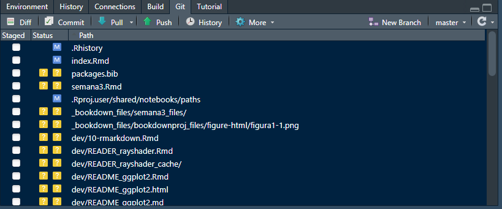
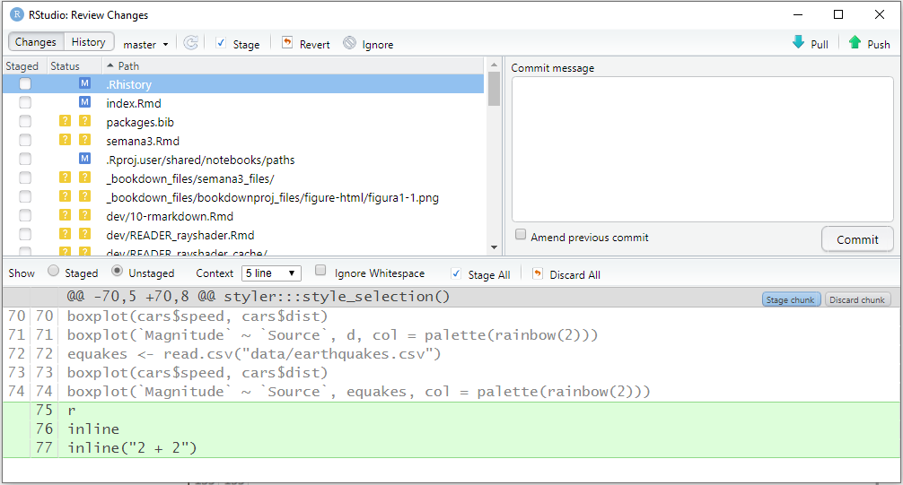
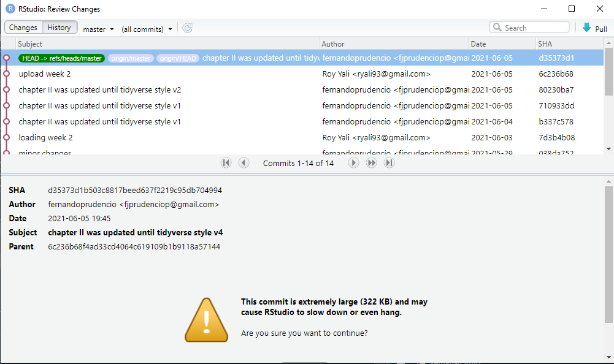

# Control de versiones

## Git
Git es un sistema de control de versiones. Cuando un repositorio está bajo el control de versiones de git, se guarda la información sobre todos los cambios realizados, guardados y confirmados en cualquier archivo no ignorado en un repositorio. Esto le permite volver a versiones anteriores del repositorio y buscar en el historial todas las confirmaciones realizadas en cualquier archivo rastreado en el repositorio. 

Si está trabajando con otros, usar el control de versiones de git le permite ver cada cambio realizado en el código, quién lo hizo y por qué (a través de los mensajes de confirmación).

Necesitarás git en tu computadora para crear repositorios de git locales que puedas sincronizar con los repositorios de GitHub. Como R, git es de código abierto. Puedes descargarlo para diferentes sistemas operativos.

### Configuración 
Después de descargar git pero antes de usarlo, debes configurarlo. Por ejemplo, debe asegurarse de que tenga su nombre y dirección de correo electrónico. Puede configurar git desde un shell bash (para Linux o Mac, puede usar “Terminal”, mientras que para PC puede usar GitBash, que viene con la instalación de git).

Puede usar las funciones de configuración de git para configurar su versión de git. Dos cambios que debe realizar son incluir su nombre y dirección de correo electrónico como nombre de usuario y correo electrónico de usuario. Por ejemplo, el siguiente código, si se ejecuta en un shell bash, configuraría una cuenta de git para un usuario llamado "Roy Yali" con su respectiva dirección de correo electrónico:

```{cmd eval=FALSE}
git config --global user.name "Roy Yali"
git config --global user.email "roy.yali@unmsm.edu.pe"
```
Una vez que haya instalado git, debe reiniciar RStudio para que RStudio pueda identificar que git ahora está disponible. A menudo, basta con reiniciar RStudio. Sin embargo, en algunos casos, es posible que deba seguir algunos pasos más para activar git en RStudio. Para hacer esto, vaya a *"RStudio" -> "Preferencias" -> "Git / SVN"*. Elija *"Habilitar control de versiones"*. Si RStudio no encuentra automáticamente su versión de git en el cuadro *"Ejecutable de Git"* (sabrá que no lo ha hecho si ese cuadro está en blanco), busque su archivo ejecutable de git usando el botón *"Examinar"* al lado de ese cuadro. Si no está seguro de dónde está guardado su ejecutable git, intente abrir un shell bash y ejecutar qué git, que debería darle la ruta del archivo si tiene git instalado.

## Inicializando un repositorio

Puede inicializar un repositorio de git utilizando comandos desde un shell bash o directamente desde RStudio. Primero, para inicializar un repositorio de git desde un shell bash, siga los siguientes pasos:

- Utilice un shell ("Terminal" en Linux o Mac) para navegar hasta ese directorio. Puede usar `cd` para hacer eso (similar a `setwd` en R).
- Una vez que esté en el directorio, primero verifique que no sea ya un repositorio de `git`. Para hacer eso, ejecute `git status`. Si recibe el mensaje `fatal: No es un repositorio de git (o cualquiera de los directorios principales): .git`, todavía no es un repositorio de git. Si no obtiene un error de `git status`, el directorio ya es un repositorio, por lo que no necesita inicializarlo.
- Si el directorio aún no es un repositorio de git, ejecute `git init` para inicializarlo como repositorio.
Por ejemplo, si quisiera crear un directorio llamado "example_analysis", que es un subdirectorio directo de mi directorio de inicio, un repositorio de git, podría abrir un shell y ejecutar:

```{cmd eval=FALSE}
cd ~ / example_analysis
git init
```
También puede inicializar un directorio como un repositorio de git a través de R Studio. Para hacer eso, siga los siguientes pasos:

1. Convierta el directorio en un proyecto R. Si el directorio es un paquete R, es probable que ya tenga un archivo `.Rproj` y también un proyecto R. Si el directorio no es un proyecto R, puede convertirlo en uno de RStudio yendo a *"Archivo" -> "Nuevo proyecto" -> "Directorio existente"*, y luego navegue hasta el directorio en el que le gustaría hacer un proyecto R .
2. Abra el proyecto R.
3. Vaya a *"Herramientas" -> "Control de versiones" -> "Configuración del proyecto"*.
4. En el cuadro de "Sistema de control de versiones", elija "Git".

I> Si no ve "Git" en el cuadro de "Sistema de control de versiones", significa que no tiene git instalado en su computadora o que RStudio no pudo encontrarlo. Si es así, consulte las instrucciones anteriores para asegurarse de que RStudio haya identificado el ejecutable git.

Una vez que inicialices el proyecto como un repositorio de git, deberías tener una ventana "Git" en uno de tus paneles de RStudio (panel superior derecho por defecto). A medida que realice y guarde cambios en los archivos, aparecerán en esta ventana para que los confirme. Por ejemplo, en la siguiente figura, se muestra como se ve la ventana de Git en RStudio cuando hay cambios en dos archivos que aún no se han confirmado.


## Commiting

Cuando desee que git registre los cambios, confirme los archivos con los cambios. Cada vez que se compromete, debe incluir un breve mensaje de confirmación con información sobre los cambios. Puede realizar confirmaciones desde un shell. Sin embargo, el flujo de trabajo más sencillo para un proyecto de R, incluido un directorio de paquetes de R, es hacer que git se comprometa directamente desde el entorno de RStudio.

Para realizar una confirmación desde RStudio, haga clic en el botón "Confirmar" en la ventana de Git.



En esta ventana, para confirmar cambios:

1. Haga clic en las casillas junto a los nombres de archivo en el panel superior izquierdo para seleccionar los archivos a confirmar.
2. Si lo desea, puede utilizar la parte inferior de la ventana para ver los cambios que está realizando en cada archivo.
3. Escribe un mensaje en el cuadro "Confirmar mensaje" en el panel superior derecho. Mantenga el mensaje en una línea en este cuadro si puede. Si necesita explicar más, escriba un mensaje corto de una línea, omita una línea y luego escriba una explicación más larga.
4. Haga clic en el botón "Confirmar" a la derecha.
5. Una vez que confirme los cambios a los archivos, desaparecerán de la ventana de Git hasta que realice y guarde más cambios.

### Historial de registros
En la parte superior izquierda de la ventana Confirmar, puede cambiar a "Historial". Esta ventana le permite explorar el historial de confirmaciones del repositorio. La siguiente figura muestra un ejemplo de esta ventana. La parte superior de esta ventana enumera las confirmaciones en el repositorio, de la más reciente a la menos. El mensaje de confirmación y el autor se muestran para cada confirmación. Si hace clic en una confirmación, puede utilizar el panel inferior para ver los cambios realizados en ese archivo con una confirmación específica.


### Conectando repositorio local con repositorio en Github
GitHub te permite alojar repositorios de git en línea. Esto le permite:

- Trabaja de forma colaborativa en un repositorio compartido
- Bifurque el repositorio de otra persona para crear su propia copia que pueda usar y cambiar como desee
- Sugerir cambios en los repositorios de otras personas a través de solicitudes de extracción

Para hacer algo de esto, necesitará una cuenta de GitHub. Puede registrarse en https://github.com. Una cuenta gratuita está bien siempre y cuando no le importe que todos sus repositorios sean "Públicos" (visibles para cualquier persona).

La unidad básica para trabajar en GitHub es el repositorio. Un repositorio es un directorio de archivos con algunos archivos complementarios que guardan información adicional sobre el directorio. Mientras que los proyectos de R tienen esta información adicional guardada como un archivo ".RProj", los repositorios de git tienen esta información en un directorio llamado ".git".

I> Debido a que esta ruta del directorio .git comienza con un punto, no se mostrará en muchas de las formas en que enumera los archivos en un directorio. Desde un shell bash, puede ver archivos que comienzan con. ejecutando ls -a desde ese directorio.

Si tiene un directorio local que le gustaría enviar a GitHub, estos son los pasos para hacerlo. Primero, debe asegurarse de que el directorio esté bajo el control de versiones de git. Consulte las notas anteriores sobre la inicialización de un repositorio. A continuación, debe crear un repositorio vacío en GitHub para sincronizar con su repositorio local. Para hacer eso:

1. En GitHub, haga clic en el "+" en la esquina superior derecha ("Crear nuevo").
2. Elija "Crear nuevo repositorio".
3. Dale a tu repositorio el mismo nombre que el directorio local al que te gustaría conectarlo. Por ejemplo, si desea conectarlo a un directorio llamado "example_analysis" en su computadora, nombre el repositorio "example_analysis". (No es necesario que el nombre de su repositorio de GitHub sea idéntico al nombre de su repositorio local, pero facilitará las cosas).
4. Deje todo lo demás como está (a menos que desee agregar una breve descripción en el cuadro "Descripción"). Haga clic en "Crear repositorio" en la parte inferior de la página.

Ahora está listo para conectar los dos repositorios. Primero, debe cambiar algunas configuraciones en RStudio para que GitHub reconozca que se puede confiar en su computadora, en lugar de pedirle su contraseña cada vez. Haga esto agregando una clave SSH de RStudio a su cuenta de GitHub con los siguientes pasos:

- En RStudio, vaya a "RStudio" -> "Preferencias" -> "Git / svn". Elija "Crear clave RSA".
- Haga clic en "Ver clave pública". Copia todo lo que aparece.
- Vaya a su cuenta de GitHub y navegue hasta "Configuración". Haga clic en "Claves SSH y GPG".
- Haga clic en "Nueva clave SSH". Nombra la tecla con algo como "mylaptop". Pegue su clave pública en el "Cuadro de clave".

## Sincronizar RStudio y GitHub
Ahora está listo para enviar su repositorio local al repositorio de GitHub vacío que creó.

1. Abra un shell y navegue hasta el directorio que desea enviar. (Puede abrir un shell desde RStudio usando el botón de engranaje en la ventana de Git).
2. Agregue el repositorio de GitHub como una rama remota con el siguiente comando (esto da un ejemplo para agregar un repositorio de GitHub llamado "ex_repo" en mi cuenta de GitHub, "geanders"):

```{cmd eval=FALSE}
git remote add origin git@github.com:geanders/ex_repo.git
```

Como nota, cuando crea un repositorio en GitHub, GitHub proporcionará un código de git sugerido para agregar el repositorio de GitHub como la rama remota de "origen" a un repositorio. Ese código es similar al código que se muestra arriba, pero usa "https://github.com" en lugar de "git@github.com"; este último tiende a funcionar mejor con RStudio.

3. Envía el contenido del repositorio local al repositorio de GitHub.

```{cmd eval=FALSE}
git push -u origin master
```

Para extraer un repositorio que ya existe en GitHub y al que tiene acceso (o que ha bifurcado y por lo tanto tiene acceso a la rama bifurcada), primero use cd desde un shell bash en su computadora personal para moverse al directorio donde quiero poner el repositorio. Luego, use la función git clone para clonar el repositorio localmente. Por ejemplo, para clonar un repositorio de GitHub llamado "ex_repo" publicado en una cuenta de GitHub con el nombre de usuario janedoe, puede ejecutar:

```{cmd eval=FALSE}
git clone git@github.com:janedoe/ex_repo.git
```

Una vez que haya vinculado un proyecto de R local con un repositorio de GitHub, puede presionar y extraer confirmaciones usando la flecha azul hacia abajo (extraer de GitHub) y la flecha verde hacia arriba (presionar hacia GitHub) en la ventana de Git en RStudio (ver Figura ?? ver ejemplos de estas flechas).

GitHub te ayuda a trabajar con otros en el código. Hay dos formas principales de hacer esto:

- **Colaboración:** diferentes personas tienen la capacidad de empujar y extraer directamente desde y hacia el mismo repositorio. Cuando una persona empuja un cambio al repositorio, otros colaboradores pueden obtener los cambios inmediatamente al extraer las últimas confirmaciones de GitHub en su repositorio local.
- **Bifurcación:** diferentes personas tienen sus propios repositorios de GitHub, cada uno vinculado a su propio repositorio local. Cuando una persona envía cambios a GitHub, solo realiza cambios en su propio repositorio. La persona debe enviar una solicitud de extracción a la bifurcación del repositorio de otra persona para compartir los cambios.

## Pull request

Puede utilizar una solicitud de extracción para sugerir cambios en un repositorio que no es de su propiedad o que no tiene permiso para cambiar directamente. Siga los siguientes pasos para sugerir cambios en el repositorio de otra persona:

1. Bifurcar el repositorio
2. Realizar cambios (localmente o en GitHub)
3. Guarde sus cambios y confíelos
4. Envíe una solicitud de extracción al repositorio original
5. Si no hay ningún conflicto y al propietario del repositorio original le gustan tus cambios, puede fusionarlos directamente en el repositorio original. Si hay conflictos, estos deben resolverse antes de que se pueda fusionar la solicitud de extracción.

También puede utilizar solicitudes de extracción dentro de sus propios repositorios. Algunas personas crearán una solicitud de extracción cada vez que tengan un gran problema que quieran solucionar en uno de sus repositorios.

En GitHub, cada repositorio tiene una pestaña "Solicitudes de extracción" donde puede administrar las solicitudes de extracción (enviar una solicitud de extracción a otra bifurcación o fusionar la solicitud de extracción de otra persona para su bifurcación).

## Merge conflicts

En algún momento, si está utilizando GitHub para colaborar en el código, obtendrá conflictos de fusión. Esto sucede cuando dos personas han cambiado el mismo código de dos formas diferentes al mismo tiempo.

Por ejemplo, digamos que dos personas están trabajando en versiones locales del mismo repositorio, y la primera persona cambia una línea a mtcars [1,] mientras que la segunda persona cambia la misma línea a head (mtcars, 1). La segunda persona envía sus confirmaciones a la versión de GitHub del repositorio antes de que lo haga la primera persona. Ahora, cuando la primera persona extraiga las últimas confirmaciones en el repositorio de GitHub, tendrá un conflicto de fusión para esta línea. Para poder enviar una versión final, la primera persona deberá decidir qué versión del código usar y confirmar una versión del archivo con ese código.

Si hay conflictos de combinación, se mostrarán así en el archivo:

```{cmd eval=FALSE}
<<<<<<< HEAD
mtcars[1, ]
=======
head(mtcars, 1)
>>>>>>> remote-branch
```

Para solucionarlos, busque todos estos puntos en archivos con conflictos (Ctrl-F puede ser útil para esto), elija el código que desea usar y elimine todo lo demás. Para el conflicto de ejemplo, podría resolverse cambiando el archivo de esto:

```{cmd eval=FALSE}
<<<<<<< HEAD
mtcars[1, ]
=======
head(mtcars, 1)
>>>>>>> remote-branch
```

A esto:

```{cmd eval=FALSE}
head(mtcars, 1)
```

Ese conflicto de fusión ahora está resuelto. Una vez que resuelva todos los conflictos de combinación en todos los archivos del repositorio, puede guardar y confirmar los archivos.

Estos conflictos de fusión pueden surgir en algunas situaciones:

- Obtienes confirmaciones de la rama de GitHub de un repositorio en el que has estado trabajando localmente.
- Alguien envía una solicitud de extracción para uno de sus repositorios y usted ha actualizado parte del código entre el momento en que la persona bifurcó el repositorio y envió la solicitud de extracción.

## Resumen
El código R se puede mantener bajo control de versiones usando git, y RStudio ofrece una funcionalidad conveniente para trabajar con un directorio bajo el control de versiones de git. También se puede enviar un directorio bajo el control de versiones de git a GitHub, que proporciona una plataforma útil para compartir y colaborar en el código.

### ¿Cómo puedo hacer un README?
