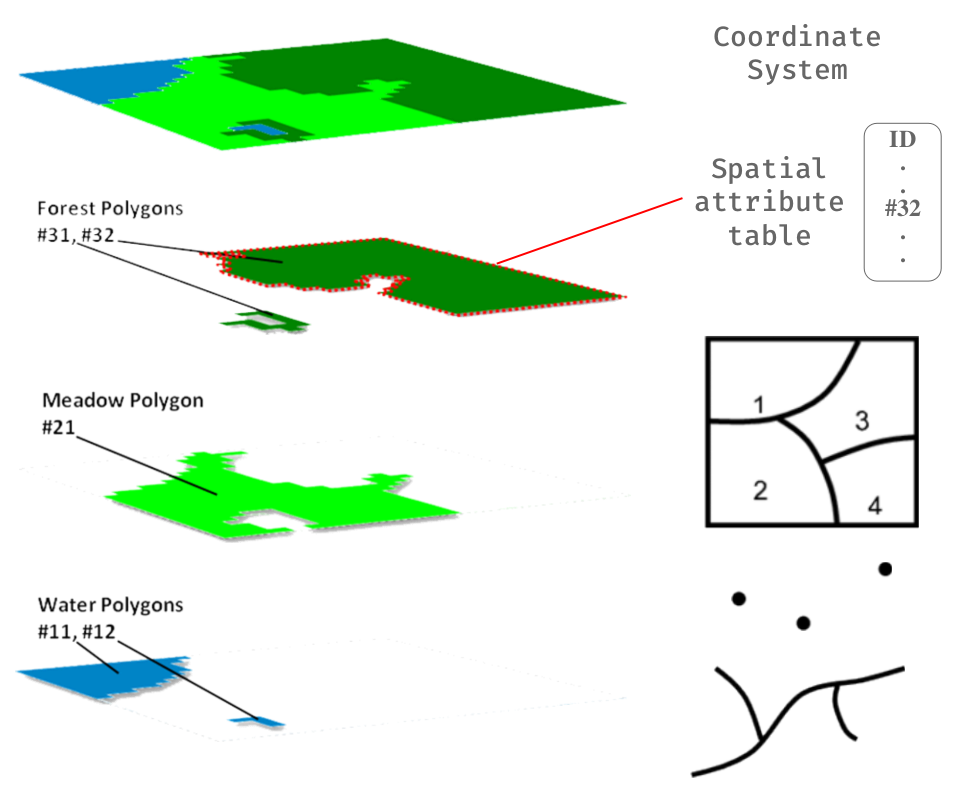
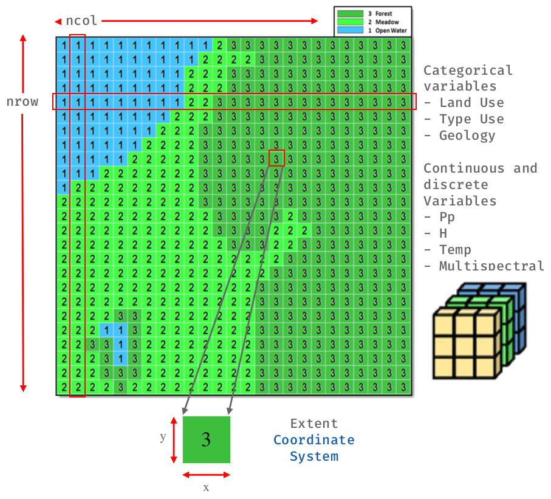
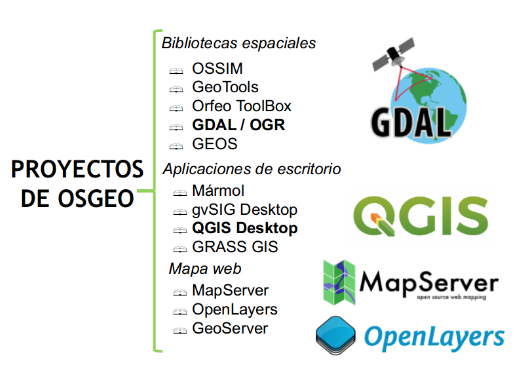

# Introducción a datos espaciales

Un modelo de datos geográfico es una abstracción del mundo real que emplea un conjunto de objetos dato, para soportar el despliegue de mapas, consultas, edición y análisis. Los datos geográficos, presentan la información en representaciones subjetivas a través de mapas y símbolos, que representan la geografía como formas geométricas, redes, superficies, ubicaciones e imágenes, a los cuales se les asignan sus respectivos atributos que los definen y describen.

Un dato espacial es una variable asociada a una localización del espacio. Normalmente se utilizan datos vectoriales, los cuales pueden ser expresados mediante tres tipos elementales de objetos espaciales.

## Datos Vectoriales

Los datos vectoriales son usados para representar espacialmente el mundo real y las variables asociadas a estas. Un objeto espacial vectorial puede ser de geometría tipo punto, línea o un polígono. Cada objeto espacial vectorial tienen datos de atributos que lo describen.

  

## Datos Raster

En su forma más simple, un ráster consta de una matriz de celdas (o píxeles) organizadas en filas y columnas (o una cuadrícula) en la que cada celda contiene un valor que representa información, como la temperatura. Los rásteres son fotografías aéreas digitales, imágenes de satélite, imágenes digitales o incluso mapas escaneados.

  

## ¿Qué es OGC?

El Open Geospatial Consortium (OGC) es una organización sin fines de lucro que fue fundado en 1994 para hacer de la **información geográfica una parte integral de la infraestructura mundial de información**. Agrupa (en mayo de 2019) a 527 miembros de organizaciones públicas y privadas (más información en https://www.ogc.org/ogc/members ). Los miembros de OGC (usuarios y proveedores de tecnología) desarrollan de forma colaborativa estándares de interfaz y los estándares asociados, así como buenas prácticas, que permiten a los desarrolladores crear sistemas de información que pueden fácilmente intercambiar información geográfica e instrucciones con otros sistemas de información. Los requisitos varían desde planificaciones complejas y control de satélites de observación terrestre a la visualización de sencillas imágenes cartográficas en la web, así como la codificación de la localización en apenas unos pocos bytes para geoetiquetado y mensajería. Un vistazo a los OGC Domain Working Groups (http://www.opengeospatial.org/projects/groups/wg) muestra el amplio espectro de la actividad actual en OGC.

  

## ¿Qué es OSGeo?

Open Source Geospatial Foundation, es una organización no gubernamental sin fines de lucro **cuya misión es apoyar y promover el desarrollo colaborativo de software, datos y educación geoespacial de código abierto**.

Los proyectos mostrados en la siguiente figura ofrecen herramientas y tecnologías disponibles gratuitamente bajo una **licencia de código abierto**. Esta lista promueve el trabajo de equipos y organizaciones en todo el mundo. Los proyectos marcados como OSGeo Community se han unido a OSGeo, mientras que los marcados como OSGeo Project  han sido objeto de una extensa tutoría con esta organización.

  

## ¿Qué es GDAL?

**Geospatial Data Abstraction Library** (GDAL/OGR) proporciona herramientas de línea de comandos para traducir y procesar una amplia gama de formatos de datos geoespaciales ráster y vectoriales.

Sus herramientas se basan en una biblioteca multiplataforma escrita en **C ++**, **accesible a través de numerosos lenguajes de programación**. Como biblioteca, presenta un único modelo de datos abstracto a la aplicación que realiza la llamada para todos los formatos admitidos.

GDAL/OGR es la biblioteca de acceso a datos geoespaciales más ampliamente utilizada. **Proporciona el motor principal de acceso a datos para muchas aplicaciones**, incluyendo MapServer, GRASS, QGIS y OpenEV. También es utilizado por paquetes como OSSIM, Cadcorp SIS, FME, Google Earth, VTP, Thuban, ILWIS, MapGuide y ArcGIS.

  

**Características Principales**

- Su última versión es la 3.3.1.
- Es un software libre de código abierto, licenciado bajo una licencia de estilo MIT/X.
- Con la versión GDAL 2.0, se integraron los componentes GDAL y OGR.
- Compatible con sistemas operativos como Windows, IOS y UNIX.
- Utilidades de línea de comandos para la traducción de datos, deformación de imagen, subconjunto y otras tareas comunes.
- Acceso a datos ráster altamente eficiente, aprovechando el mosaico y las vistas generales.
- Soporte para archivos de gran tamaño - más de 4 GB.
- Acceso a la biblioteca desde Python, Java, C#, Ruby, VB6 y Perl.
- Motor de sistema de coordenadas basado en PROJ.4 y descripciones de sistema de coordenadas con Well Known Text (WKT) de OGC.

**Formatos Popularmente Compatibles**

GDAL soporta más de 140 formatos ráster y OGR con más de 80 formatos de vector.

Éstas incluyen:

- Raster: GeoTIFF, Erdas Imagine, SDTS, ESRI Grids, ECW, MrSID, JPEG2000, DTED, NITF, GeoPackage y más ...
- Vector: GeoPackage, ESRI Shapefile, GML, GeoJSON, AutoCAD DWG, MapInfo (tab y mid / mif), ESRI Coverage, ESRI Personal Geodatabase, DGN, PostGIS, Oracle Spatial, y más ...

## ¿Qué es Proj?

**PROJ** es un software de transformación de coordenadas genérico que transforma las coordenadas geoespaciales **de un sistema de referencia de coordenadas (CRS) a otro**. Esto incluye proyecciones cartográficas y transformaciones geodésicas.

PROJ incluye  aplicaciones de [línea de comandos](https://proj.org/apps/index.html#apps) para una **fácil conversión de coordenadas** de archivos de texto o directamente desde la entrada del usuario. Además de las utilidades de la línea de comandos, PROJ también expone una [interfaz de programación de aplicaciones](https://proj.org/development/reference/index.html#reference), o API en resumen. **La API permite a los desarrolladores usar la funcionalidad de PROJ en su propio software sin tener que implementar una funcionalidad similar ellos mismos**.

PROJ comenzó simplemente como una aplicación de cartografía que permitía a los usuarios convertir coordenadas geodésicas en coordenadas proyectadas utilizando una serie de proyecciones cartográficas diferentes. A lo largo de los años, a medida que la necesidad se ha hecho evidente, el apoyo para cambios de datum también se ha abierto camino lentamente en PROJ. Actualmente, **PROJ admite más de cien proyecciones de mapas diferentes y puede transformar coordenadas entre datums** utilizando todas las técnicas geodésicas, excepto las más oscuras.

Para obtener más información, visite el [sitio web del proyecto](https://proj.org/) o consulte su documentación en [formato PDF](https://raw.githubusercontent.com/OSGeo/proj.4/gh-pages/proj.pdf).
